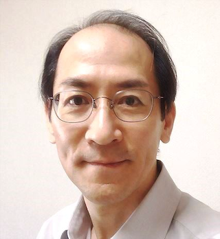

# 伊藤俊英 / Toshihide Itoh, Ph.D.

<table><tr>
    <td>
        
    </td>
    <td valign='bottom'>
        <b>独立研究者 / Independent Researcher</b> 
        <b>研究開発コンサルタント / R&D Consultant</b> 
         
    </td>
</tr></table>

<!--
  
**独立研究者 / Independent Researcher**  
**研究開発コンサルタント / R&D Consultant**  
 
-->

独立研究者としての活動のほか、下記のような案件（詳細は「専門分野」を参照）に対するコンサルティング等をおこなっています。

- 医療機器関連企業におけるX線CT装置の研究開発
- 研究所や大学等のアカデミアにおける医用画像工学全般に関する学術研究
- 画像診断領域の研究やマーケットに関する今後の展望
- 関連分野に関する講演や執筆

## 経歴概略

- 国内外の企業でX線CT装置の開発業務に30年以上、そして2010年からは**フォトンカウンティングCT**の研究開発に従事。
- 国内の様々な大学医学部にて学術研究の指導経験あり（20年以上）。
- 医療行政や医療機器界隈の知見や人的ネットワークも豊富。
- 学会・研究会などでの講演、大学での講義、医療雑誌媒体等への執筆も多数。

## 専門分野

### 1. X線CT装置における計測制御やデータ補正処理全般
医用画像工学全般のほか、特に下記の領域を専門としています。

- X線CTのシステム設計
- X線物理シミュレーション
- 検出器物性・物理解析
- 計測データプロセッシング開発
- データ補正や画像再構成のアルゴリズム開発
- スペクトラルイメージングアルゴリズムの開発
- フォトンカウンティングCTのシステム設計
- フォトンカウンティングCTのデータ計測、補正アルゴリズムなどの開発
- CdTe、Si検出素子の物性解析
- X線CTの画質改善

### 2. 研究開発チームマネージメント
- マーケット分析に基づいた中長期開発計画の立案。
- R&Dチーム運営、プロジェクト管理など。

### 3. 医学・工学分野の学術研究支援・教育
- 研究テーマの選択、研究計画立案から実践、科研費取得・学会発表・論文作成、学位取得の指導など。

## 職歴
- 〜2001年9月: 株式会社日立メディコ CT事業部
- ～2024年7月: シーメンスヘルスケア株式会社 CT-R&D、チーフサイエンティスト
- 2024年7月〜: 独立研究者 / 研究開発コンサルタント（フリーランス）

## 実績
- [Research map](https://researchmap.jp/tnitoh?lang=jp){:target="_blank"}
- [ORCID](https://orcid.org/0000-0002-0283-1225){:target="_blank"}

## 連絡先

toshihide.itoh＠gmail.com

[ご連絡いただくにあたってのお願い](contact_note.md)
